# Project 2: Game Design Document

---

### 1. Game Overview

- **Core Concept**  
  Players control Felyne, a clumsy but determined cat who dreams of baking the perfect cake. After being mysteriously shrunk to miniature size in his dream, Felyne must navigate an ordinary kitchen that now feels enormous. His mission is exploring, collecting ingredients, avoiding hazards, and completing Quick Time Events (QTEs) to bake cake correctly. The game blends platformer, adventure, and light cooking simulation.
- **Related Genres**

  - **Genres:** 3D Platformer / Adventure / Cooking Simulation
  - **Inspirations:**
    - _Overcooked!_ (kitchen interaction and cooking tasks)
    - _Ori and the Blind Forest_ (platforming style)
    - _Untitled Goose Game_ (simple, brightly colored art direction and checklist style)
    - _Dead By Daylight_ (QTE)

- **Target Audience**  
  Teens and young adults who love cozy platformers, cute animal characters, and cooking-themed adventures, but also crave moments of challenge. Designed to be easy to pick up yet challenging to win within short time (reach HE), the game appeals to both casual players and those who enjoy refining their skills through replay.

- **Unique Selling Points (USPs)**
  - **Miniature Perspective:** Contrast between "enlarged" everyday kitchen objects and ingredients and shrunk Felyne’s model.
  - **Platforming + Cooking Fusion:** Jumping challenges (with obstacles and hazard) and ingredient collection and interactive cooking QTEs.
  - **Multiple Endings:** Besides die during gameplay, players' performance in QTE and finiding ingredients lead to a light-hearted Happy End or nightmare-like Bad End, increasing replay value.

---

### 2. Story and Narrative

- **Backstory** 📖
  _(What is the setting, conflict, and plot progression?)_

  Felyne is a lovely yet sometimes clumsy cat 🐱 who has always dreamed of baking a perfect cake ever. Unfortunately, all of his attempts in the kitchen ended up in failure — burnt edges, collapsed batter, mistook salt as sugar, and so on.

  One night, after another failed attempt, Felyne fall asleep in disappointment as usual. But in his dream, a mysterious strawberry spirit 🍓 appears and whispers, “Maybe if you could become part of the ingredients, and you could finally make it work…” “Become an ingredient? No, I just want to make the cake!”Suddenly, Felyne finds himself shrunk down, "This is your chance now, ready to make the cake? Success.. or become an ingredient.. Good luck, Felyne..."😈

  **Settings**

  The story takes place in the Felyne's kitchen in his dream. Felyne becomes tiny, hence everyday objects become towering obstacles. The kitchen is colorful and welcoming, filled with both charm and hidden danger, including the sneaky mice and the risk of burnt by fire flame on gas cylinders. (What a dangerous kitchen!)

  **Conflict**

  Felyne’s dream of baking the perfect strawberry cake becomes a challenge, when he’s mysteriously shrunk and trapped in his own kitchen. To return to normal and prove his worth as a baking lover, he must overcome his clumsiness and face the dangers of an "oversized" world. Things in the kitchen from harmless to life-threatening, such as mischievous mice, scorching flames, and tricky baking tasks...

  - adventure to find the ingredients (somes are hidden)
  - avoid mischievous mice disrupt his adventure on the floor
  - avoid "randomly" lighting up gas cylindars (with flames)
  - adventure through various obstacles
  - perform proper QTE to put proper amount of correct ingredients into mixture pot and for decoration to succeed

## **Plot progression**

**Beginning**:

This is the umpteenth attempt Felyne tried to bake a cake, but he still failed. He fall asleep in deep frustration. In his dream, there is a strawberry spirit talking to him, suggesting that he will success if he becomes a part of cake 😈. Felyne refused the spirit, and suddenly shrink down. Only making out a perfect cake would escape the fate of becoming an ingredient.. Ready to start the adventure?

**Middle**:

Felyne investigates the BIG kitchen, spots and collects ingredients in kitchen, and put the ingredients together correctedly to make the cake. The journey will be full of whimsical and potential dangers.

**End**:

- HE: Felyne successfully make the cake, he has a nice time enjoying the cake he made, and returns to his normal size. "Congrats, Felyne..." he heard the strawberry spirit's voice, looking around, but couldn't find her anymore. In the morning, Felyne woke up, and tries to make a cake in reality like how he did in the dream, he eventually succeed, just like in his dream. 🎉
- BE: Felyne fails to make the cake, "Heh heh heh..." the strawberry spirit smirked. Felyne is trapped into the cake module, and couldn't do anything anymore. The stawberry spirit proudly look at poor Felyne and send him into heating oven.

- **Characters**  
  _(Who are the main characters, their motivations, relationships, and appearances?)_

  - **Felyne**
    The character player controls, it is a cat who loves baking, his goal is to successfully bake a cake.
    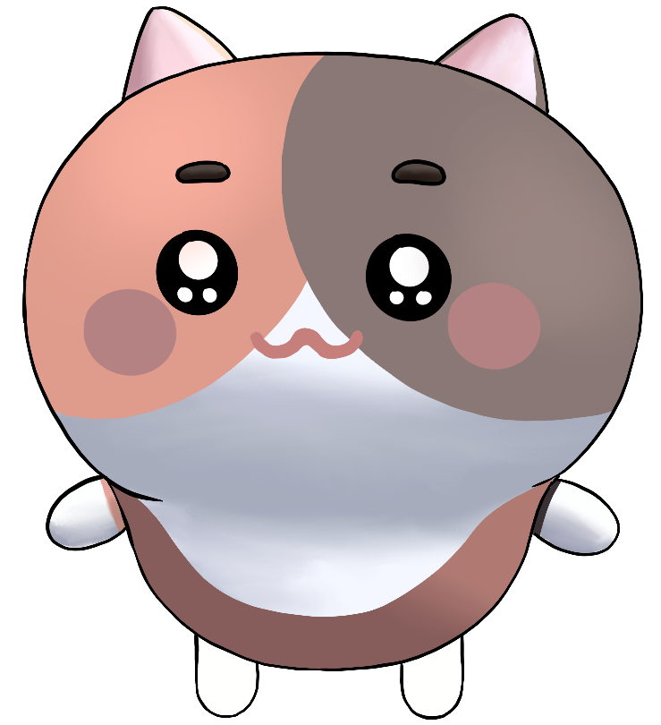
  - **Strawberry spirit**
    The character appeared in Felyne's dream, motivating Felyne to bake the cake. She is not bad by nature, but if you cannot do what she asks, you will still be punished in some way...
    

---

### 3. Gameplay and Mechanics

- **Player Perspective**  
  This is a 3D platformer game, emphasising on exploring/adventure, collecting items and QTE. The game has a third-person perspective during adventure. Camera is automatically following PC model along left and right. The player character is a shrunken cat walking in a normal (cat-size) "dangerous" kitchen, making everyday objects feel giant and dangerous. And during QTE events, the camera switches to first-person perspective towards target (i.e. cake, mixture and oven).

- **Controls** 🎮

  - A/D - Move left/right (x-axis)
  - W/S - Move into/out of wall/screen (z-axis)
  - Space - Jump (y-axis), press twice for double jump and used in Quick Time Event when prompted.
  - E - picking up and dropping the item
  - Q - opening door of appliance, entering QTE part
  - R - picking up and sending pot to the oven or its fixed location

    There is no special control or combo in this game because we want the controls be minimal to keep the player focus on exploration. Player will control the character via these buttons to explore the kitchen, finding the ingredients they need, mixing them together and finally get the cake baked.

- **Progression**  
  The game has a variety of obstacles and challenges, which increase in difficulty as the game progresses.
  Types of obstacles:

  - Static Obstacles (Can pass through jumping at appropriate point): plants, furniture ...
  - Dynamic Obstacles (Increase difficulties): gas cylinder which spews fire periodically, must choose the optimally to jump over it; mice as enemies on the ground, they patrol along a fixed route, colliding with them results in failure;
  - Quick Time Event (QTE): QTEs are introduced to make the baking process interactive and skill-based. When Felyne adds ingredients to the mixture, decorates the cake, or sets the oven temperature, a QTE sequence is triggered to determine accuracy and success. These events control the proportion of ingredients and baking temperature, directly affecting the final result of the cake.

    - Ingredient Mixing: Triggered when the player character approaches the cake module while holding any ingredient. Successful QTE input ensures proper mixing ratios.

    - Baking Preparation: Once all ingredient-mixing QTEs are completed, a final QTE appears to set the correct oven temperature for baking.
      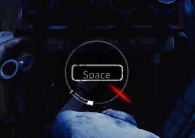

    Considering the introduction of Quick Time Event, we develop a scoring system (Perfect: +10; Good: +5; Miss: 0; If ingredient is not in the list: score locks into 0) to record the scores that player get. The cumulative score determined by result form QTE will lead to BE or He.

    **Bad End**:
    The player fails to collect all ingredients or makes mistakes during QTEs, such as incorrect ingredient choice, wrong proportions, or unsuitable oven temperature. If the final score is lower than 80% of full score, it will end up with a ruined cake and Felyne’s dream collapsing once again, leaving him disappointed.

    **Happy End**:
    The player successfully collects all ingredients, overcomes hazards, and bakes a perfect cake with correct ingredient choice, amount and oven temperature. The reward is a delicious-looking cake and the mastery of cooking skills.

- **Gameplay Mechanics**  
  This game includes adventure, items collection, Quick Time Event leads to multiple endings. The whole adventure process is:

  1. Explore the kitchen + Collect ingredients for **mixture**
  2. Perform QTE to put holding ingredient into module for **mixture**
     Repeat Step 1-2 until done
  3. Bake the cake by choosing oven temperature (QTE).
  4. Explore the kitchen + Collect ingredients for **decoration**
  5. Perform QTE to put holding ingredient on the baked cake for **decoration**
     Repeat Step 4-5 until done
  6. Go to ending

  - at any time, player may:
    - choose to early finish, go to the ending
    - die during adventure (loss 3 Hp due to fire or mice)

  **Rules & Actions**:

  - The player can carry and drop items and perform jumps to different levels, move left, right, into, out of the screen
  - Hazards and/or obstacles must be avoided through movement, otherwise -1 Hp (3 in total)
  - Results of QTEs and correctness of ingredients used for making cake determine whether the player achieves success or failure.

  **Fun fact**:

  As Felyne, you can put almost anything into the cake—experiment freely, but don’t be surprised if your masterpiece turns into a disaster!

---

### 4. Levels and World Design

- **Game World**  
  _(Is it 2D, 2.5D, 3D? How does navigation work? Maps/minimaps?)_

  The game takes place in a single, continuous kitchen setting, presented as a side-scrolling **3D platformer**. The camera follows the player character left to right. Player navigates through the kitchen by adventure across the kitchen and avoiding mice and hazards. Outline highlight will occur when character approaches an interactive item (different color for doors and ingredients).

  The kitchen is designed with multiple sections: cooking table, fridge, oven, gas cylinders and so on. Each section contains baking ingredients, obstacles and some platform challenges.

  There is no map/minimap, encouraging players to explore visually and rely on environmental cues to guide progress through the kitchen.

- **Objects**  
   \_(What interactive objects exist, and how do they interact?)
  | **Category** | **Objects (Examples)** | **Appearance / Location** | **Role with Player** | **Interaction with Others** |
  | ------------------------- | -------------------------------------------- | -------------------------------------------------- | --------------------------------------------------------------- | ------------------------------------------------------------------- |
  | **Correct Ingredients** | Egg 🥚, Milk 🥛, Flour, Sugar, Strawberry 🍓, Butter, Cream | Placed around the kitchen (table, shelves, fridge) | Can be picked up and used in QTEs to make mixture or decoration | Used with cake modules to increase score and progress toward **HE** |
  | **Incorrect Ingredients** | Other Kitchen Items | Mixed among real ingredients | Can be picked up but cause **score = 0** when used in QTEs | Treated as failure input; may lead to **BE** if repeatedly used |
  | **Modules / Stations** | Mixing Pot, Cake Base, Oven | Fixed in main kitchen zones | Trigger QTEs when interacted with while holding items | Connected to QTE and scoring system (determines HE/BE) |
  | **Hazards** | Gas Cylinders 🔥, Open Flames | Floor and oven areas | Deal −1 HP on contact | Ignite periodically; overlap with platform paths |
  | **Enemies** | Mice 🐭 | Patrol the floor | Colliding causes −1 HP | May chase dropped ingredients |
  | **Utility / UI** | Appliance Doors, Checklist, QTE Bar | At appliances / on-screen | Provide prompts and track QTE timing | Update dynamically based on player actions |

- **Physics**  
  _(What physics are present? Gravity, collisions, interactions?)_

- **Gravity**: real-world gravity

  **Movement Rules**:
  | **Category** | **Movable?** |
  | --------------------------------------------------------- | ------------------------------------------------------------------------------ |
  | **Any Ingredients** (outlined in cyan when nearby) | ✅ Pick up / drop by player |
  | **Incorrect Ingredients** (i.e. not on the checklist for current stage of baking) | ✅ Pick up / drop, but cause QTE failure |
  | **Appliances** (oven, fridge, mixer) | ❌ Heavy objects – cannot move |
  | **Mice (Enemies)** | 🚫 Player cannot move them, but they **move autonomously** along patrol routes |
  | **Scene Props** (furniture, utensils, background objects) | ❌ Static – decorative only |

  **Collision Rules**:
  | **A / B** | **Player** | **Ingredient (Correct / Incorrect)** | **Hazard (Flame / Gas Cylinder)** | **Enemy (Mouse)** | **Module (Mixing Pot / Oven / Cake Base)** |
  | ----------------- | --------------------------------------------- | ----------------------------------------------------------------- | --------------------------------- | ------------------------------- | --------------------------------------------------------------------- |
  | **Player** | — | ✅ **Trigger:** pick/drop item; start QTE when holding near module | ❌ **−1 HP:** damaged on contact | ❌ **−1 HP:** damaged on contact | ✅ **Trigger:** QTE when holding ingredient; can **carry pot to oven** |
  | **Ingredient** | ✅ Picked up / dropped by player | — | - | - | ✅ Used in QTE when placed correctly |
  | **Hazard** | ❌ Damages player on contact | — | — | — | — |
  | **Enemy (Mouse)** | ❌ Damages player on contact | — | — | — | — |
  | **Cake Module/Pot** | ✅ Trigger QTE or send to the oven when player interacts | ✅ Accepts ingredient input | — | — | — |

Note: each cell for A/B represents collision rule between object type A and B

---

### 5. Art and Audio

- **Art Style**  
  _(Overall aesthetic, colors, shapes, textures. Include concept art/sketches if possible.)_

  Our aesthetic is cozy, cute, and calm. The world is a softly toon-styled kitchen where pastel pinks and creams set the mood, lightly accented with mint. Objects use rounded, chunky shapes and clean, low contrast textures (matte wood, glossy ceramic, brushed metal) so everything reads clearly at a glance.

  **Draft game screen arrangement**:
    

    
    

            
    Note: Scene Props and  Appliances
     Ingredient 
     Untensils
     Scene Props as obstacles

  

  **Original Kitchen Asset looks**:
    

    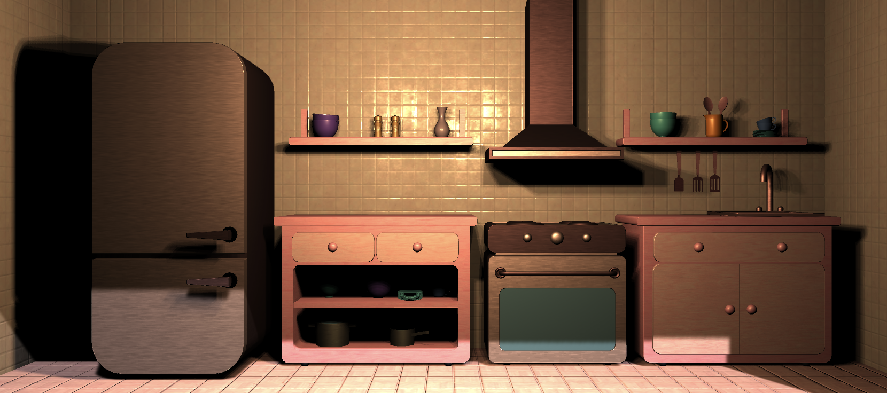
    

  **Art style references**

  - Cookie Run: Ovenbreak - game play screen
    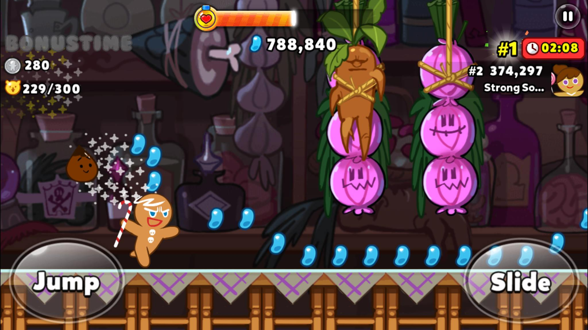
  - Overcooked2 - ingredient and untensils
    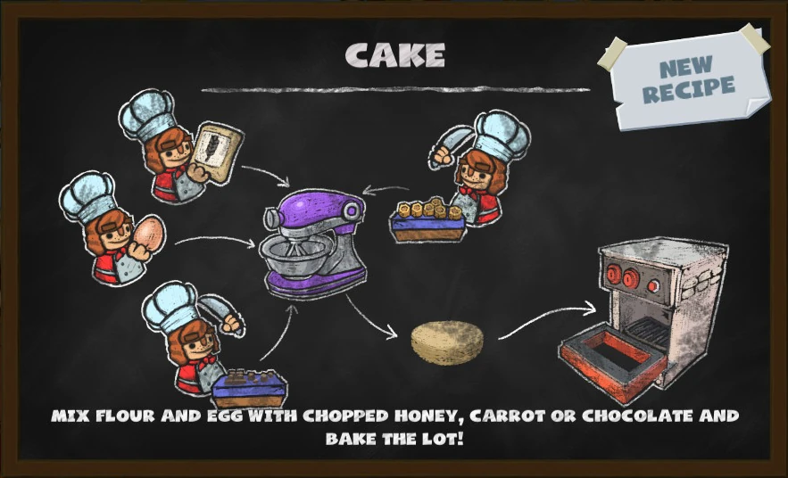

  - **Sound and Music**  
    _(What sound effects/music are used? How do they fit the theme?)_
    Warm, lo-fi music sets a cozy tone on the home page and continues in gameplay, subtly layering up during action while staying relaxed during calm moments. Endings switch to BGM that matches the mood—bright and uplifting for the happy ending, subdued and minor for the bad ending. Sound effects are simple, fun, and cartoon-like (soft pops, whooshes, sparkles, playful UI clicks).

    - BGM:

      - start scene: [始めようよ!](https://music.youtube.com/watch?v=fJrddZxgOmU&si=0cajChgF8QdpXnGt)
      - gameplay:[Heartbeat, Heartbreak](https://www.youtube.com/watch?v=_ADWQRk58Hk)
      - BE: [CULT](https://music.youtube.com/watch?v=I2lhXF1OKCI&si=VdYWmLyB8sIsqOCd)
      - HE: [はれ模様](https://music.youtube.com/watch?v=jojlvQt_SUg&si=7dN381qlWhjXUCjw)

    - Sound effects:
      - UI sound effect from Persona 4 Golden
      - Dialogue sound effect: from Ace Attorney
      - Others: from
        - [pixabay](https://pixabay.com/sound-effects/)
        - [YouTube @SoundLibrary1](https://www.youtube.com/@SoundLibrary1)
        - [Unity AssetStore](https://assetstore.unity.com/audio/sound-fx)

  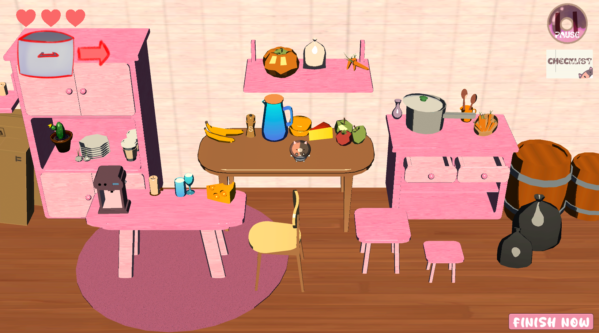

  - **Assets**  
    _(List artistic assets you will use or source, with references/URLs.)_

    - [Free Kitchen - Cabinets and Equipment](https://assetstore.unity.com/packages/3d/props/interior/free-kitchen-cabinets-and-equipment-245554)
    - [Lowpoly Art Deco Furniture](https://assetstore.unity.com/packages/3d/environments/lowpoly-art-deco-furniture-249606)
    - [Customizable Lights and Candles](https://assetstore.unity.com/packages/3d/characters/customizable-lights-and-candles-104628)
    - [Simple Stylized Cardboard Boxes](https://assetstore.unity.com/packages/3d/props/simple-stylized-cardboard-boxes-308830)
    - [Toony Kitchen & Ingredients Model FREE](https://assetstore.unity.com/packages/3d/props/toony-kitchen-ingredients-model-free-301805)
    - [Match 3d Object Pack: Fruits & Vegetables](https://assetstore.unity.com/packages/3d/props/food/match-3d-object-pack-fruits-vegetables-284706)
    - [Little Friends - Cartoon Animals - Lite](https://assetstore.unity.com/packages/3d/characters/animals/little-friends-cartoon-animals-lite-262505)
    - [Quirky Series - FREE Animals Pack | 3D Animals | Unity Asset Store](https://assetstore.unity.com/packages/3d/characters/animals/quirky-series-free-animals-pack-178235)
    - [Stylized Potted Plants](https://assetstore.unity.com/packages/3d/vegetation/plants/stylized-potted-plants-290047?srsltid=AfmBOopTa7OHiLdhDa-i1igkPeSsVq7F1chcbyOl6DlauJphn4-JDAug)
    - [Legacy Particle Pack](https://assetstore.unity.com/packages/vfx/particles/legacy-particle-pack-73777)
    - [Food Pack | Free Demo | 3D Food | Unity Asset Store](https://assetstore.unity.com/packages/3d/props/food/food-pack-free-demo-225294)

---

### 6. User Interface (UI)

The game's user interface design focuses on showing the warmth of the kitchen, by using soft and appetizing colors with mainly cute food and cat icon.

**Start Menu**:

Includes the game title and a Start Game button. Background is a 2D cg with simple background and a Felyne in the middle.

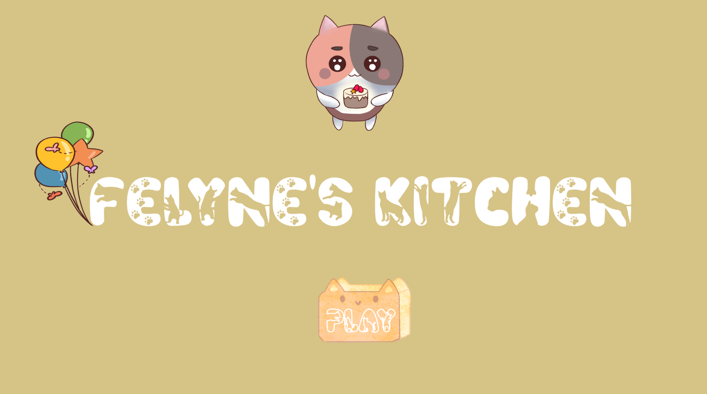

**Tutorial Display**:

Automatically appears at the beginning or when the player clicks on Tutorial button in pause menu. Shows the control guide, short descriptions of each action and task.

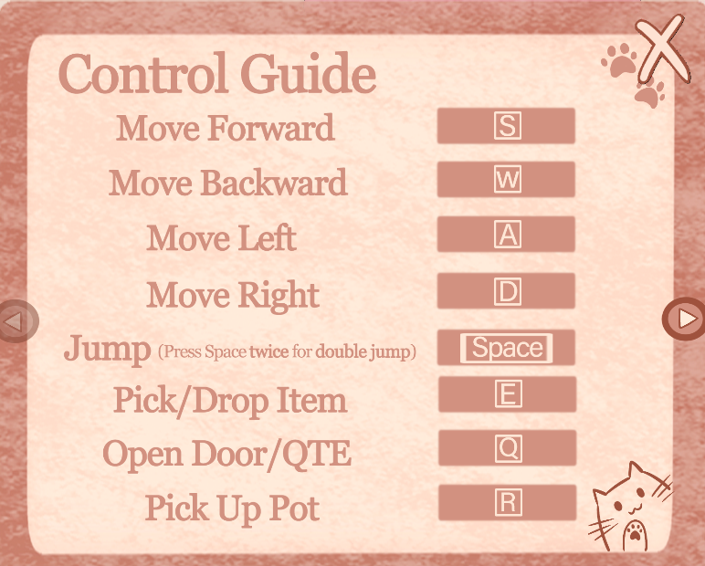

**In-Game HUD**:

- Hp: display player's current health point

- Hint for pot direction: guide player to find pot/cake module

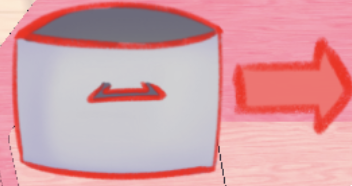

**Buttons**

- checklist button: click to show checklist of ingredients (tick if already put in during correct stage)

  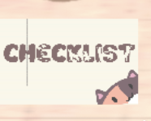

  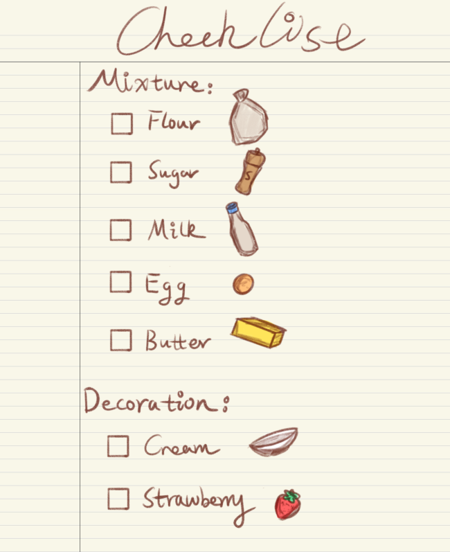

- pause button: click to pause the game and pop up pause menu

  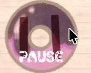

- finish now: click to submit cake early (if want to terminate game play or can't find more ingredients for cake)

  

**Pause Menu**:
Display when click pause button, with **Resume**, **Restart**, **Tutorial** and **Exit** buttons on it

- Resume: continue game play
- Restart: restart the game
- Tutorial: view tutorial
- Exit: quit the game

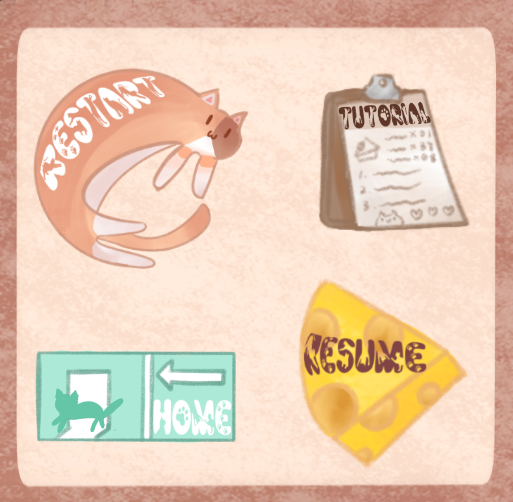

---

### 7. Technology and Tools

- **Unity**
- **GitHub**

Optional: image/audio editing, 3D modelling tools Include version numbers and links if relevant.

- **Procreate**
- **PhotoShop**
- **CapCut**

---

### 8. Team Communication, Timelines, and Task Assignment

- Plan out **who does what**.
- Which tools will you use (e.g., Trello, Discord, Slack)? **Discord**

  **Timelines**:

  Try to finish everything 3 days before milestone due dates. 1-2 meeting every week to discuss and catchup.

  **Task Assignment**:
  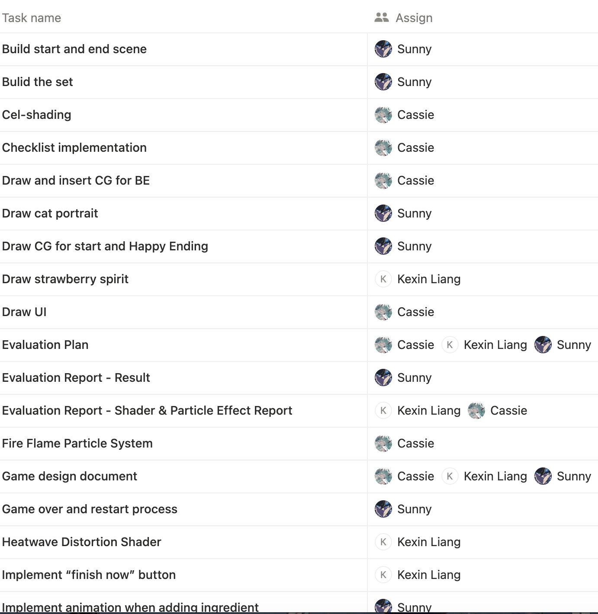
  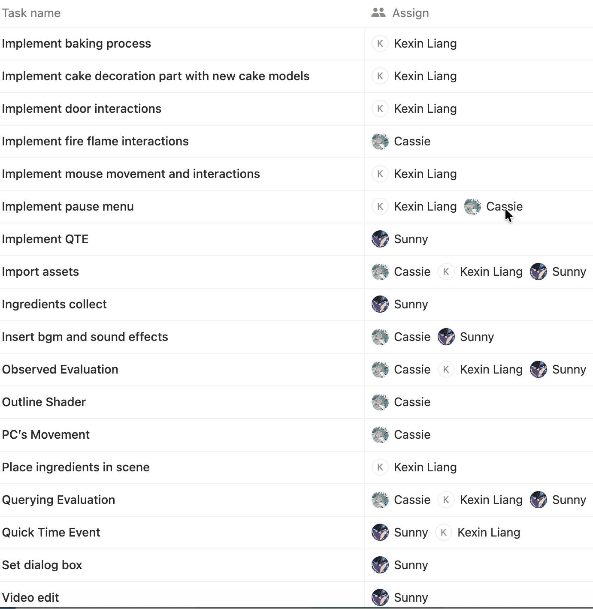
  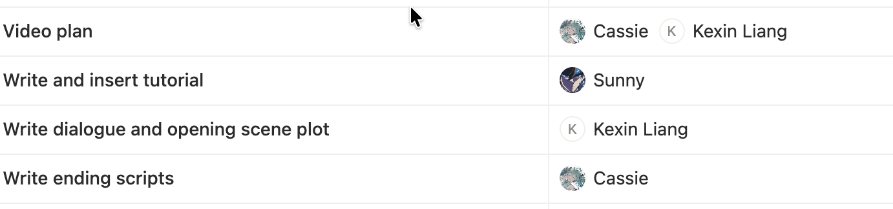

---

### 9. Possible Challenges

- List technical, creative, or scheduling challenges you foresee.
- Suggest ways to mitigate them (e.g., prototyping, testing).

**Technical**

- WebGL performance/asset size issues → test builds frequently, debug and optimise early.
- Shaders & physics may be tricky → start simple, prototype with suitable amount and difficulty of game mechanism implementation and adjust later.

**Creative**

- Conveying miniature scale → exaggerate proportions, camera tricks.
- QTE balance and art style consistency → tune via playtests, unify visuals with shaders.

**Scheduling**

- Workload imbalance & merge conflicts → split tasks based on mechanism, commit and push frequently, review PRs ASAP.
- Time pressure near deadlines → plan to finish everything 3 days before milestone due dates, feature freeze by Week 8, final weeks for polish.
