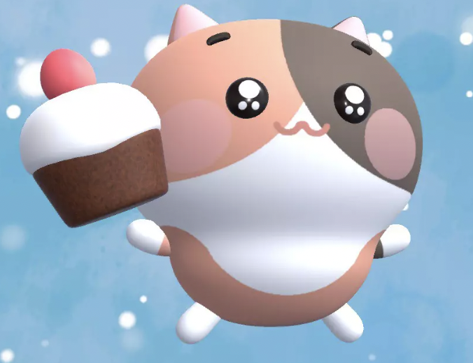
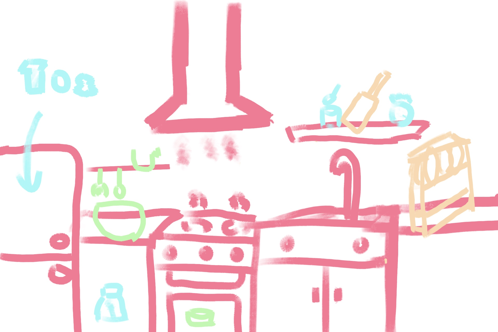
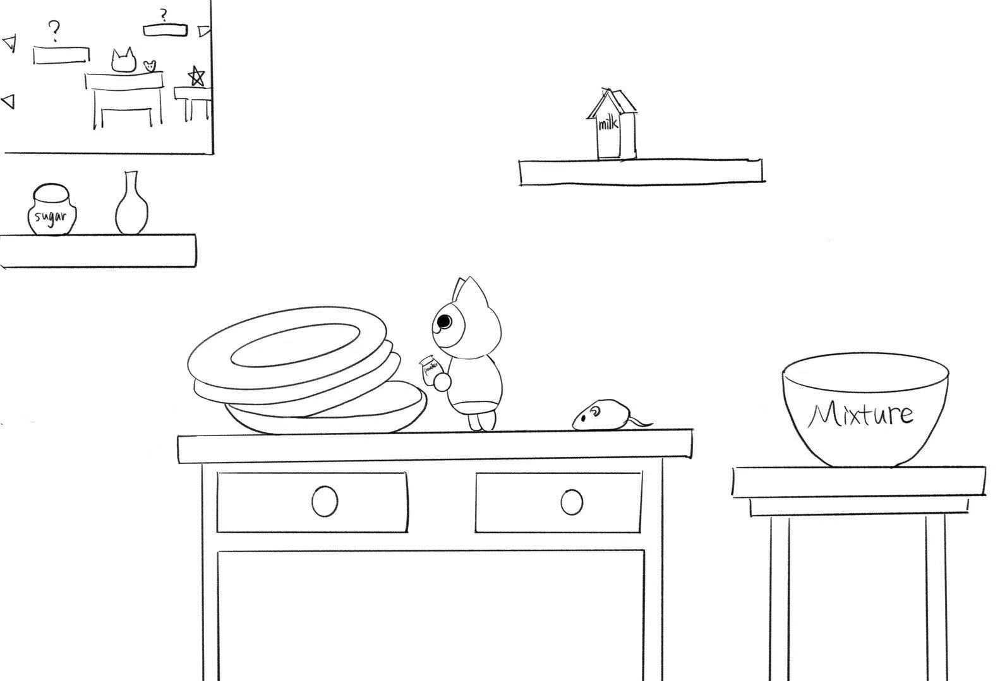
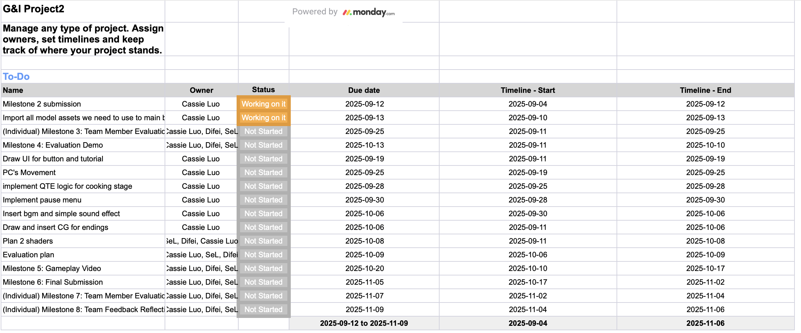

# Project 2: Game Design Document

---

### 1. Game Overview

- **Core Concept**  
  Players control **Felyne**, a clumsy but determined cat who dreams of baking the perfect cake. Set in a whimsical miniature kitchen, the player explores, collects ingredients, avoids hazards, and completes Quick Time Events (QTEs) to bake correctly. The game blends platforming, adventure, and light cooking simulation.

- **Related Genres**

  - **Genres:** 3D Platformer / Adventure / Cooking Simulation with camera sliding left and right following the PC model
  - **Inspirations:**
    - _Overcooked!_ (kitchen interaction and cooking tasks)
    - _Ori and the Blind Forest_ (platforming style)
    - _Untitled Goose Game_ (simple, brightly colored art direction)

- **Target Audience**  
  Casual to mid-core players, especially teens and young adults who enjoy cozy, lighthearted platformers, cooking games, and animal-themed characters. Accessible enough for casual play but with replayability for more engaged players.

- **Unique Selling Points (USPs)**
  - **Miniature Perspective:** Contrast between "enlarged" everyday kitchen objects and ingredients and shrunk Felyne’s model.
  - **Platforming + Cooking Fusion:** Jumping challenges (with obstacles and hazard) and ingredient collection and interactive cooking QTEs.
  - **Multiple Endings:** Success or failure in baking leads to a Happy End or Bad End, increasing replay value.

---

### 2. Story and Narrative

- **Backstory** 📖
  _(What is the setting, conflict, and plot progression?)_

  Felyne is a lovely yet sometimes clumsy cat 🐱 who has always dreamed of baking a perfect cake ever. Unfortunately, his every attempt in the kitchen ends in failure — burnt edges, collapsed batter, too much sugar, and so so on.

  One night, after yet another failed attempt, Felyne fall asleep in disappointment. In the dream, a mysterious strawberry spirit 🍓 appears and whispers, “Maybe if you could become part of the ingredients, and you could finally make it work…” “Become an ingredient? No, I just want to make the cake!”Suddenly, Felyne finds himself shrunk down, "This is your chance now, ready to make the cake? Success.. or become an ingredient.. Good luck, Felyne..."😈

  **Settings**

  The story takes place in the Felyne's kitchen in his dream. Felyne becomes tiny, hence everyday objects become towering obstacles. The kitchen is colorful and welcoming, filled with both charm and hidden danger, including the sneaky mice and the risk of falling off.

  **Conflict**

  To bake the perfect cake 🍰, Felyne must gather all ingredients needed scattered around the kitchen. However, his tiny size makes this tasks difficult. Challenges are both physical and strategic: Felyne (PC) must

  - adventure to find the ingredients (somes are hidden)
  - avoid mischievous mice disrupt his adventure on the floor
  - avoid "randomly" lighting up gas cylindars (with flames)
  - adventure through various obstacles
  - perform proper QTE to put proper amount of ingredients into mixture pot to succeed

  ## **Plot progression**

  **Beginning**:

  This is the umpteenth attempt Felyne tried to bake a cake, but he still failed. He fall asleep in deep frustration. In his dream, there is a strawberry spirit talking to him, suggesting that he will success if he becomes a part of cake 😈. Felyne refused the spirit, and suddenly shrink down. Only making out a perfect cake would escape the fate of becoming an ingredient.. Ready to start the adventure?

  **Middle**:

  Felyne investigates the BIG kitchen, spots and collects ingredients in kitchen, and put the ingredients together correctedly to make the cake. The journey will be full of whimsical and potential dangers.

  **End**:

  - HE: Felyne successfully make the cake, he has a nice time enjoying the cake he made, and returns to his normal size. "Congrats, Felyne.." he heard the strawberry spirit's voice, looking around, but couldn't find her anymore. In the morning, Felyne woke up, and tries to make a cake in reality like how he did in the dream, he eventually succeed... 🎉
  - BE: Felyne fails to make the cake, "I'm sorry Felyne.." the strawberry spirit says. Felyne becomes an strawberry, and couldn't do anything. The stawberry spirit makes a cake, and put Felyneberry on the cake as her last step. The spirit takes a piece of cake with Felyne on it, and starts to eat.. As Felyne is almost swallowed by the spirit, he woke up with startle. （P.S.: the strawberry was also a cat bad at baking)

- **Characters**  
  _(Who are the main characters, their motivations, relationships, and appearances?)_

  - **Felyne**
    The character player controls, it is a cat who loves baking, his goal is to successfully bake a cake, which brings satisfaction and joy, completing the emotional arc from disappointment to delight.
    

    
    

  - **Strawberry spirit**
    The character appeared in Felyne's dream, motivating Felyne to bake the cake. She is not bad by nature, but if you cannot do what she asks, you will still be punished in some way...

---

### 3. Gameplay and Mechanics

- **Player Perspective**  
  This is a 3D platformer game, emphasising on exploring/adventure, collecting items and QTE. The game has a third-person perspective during adventure. Camera is automatically following PC model along left and right. The player character is a shrunken cat walking in a normal (cat-size) "dangerous" kitchen, making everyday objects feel giant and dangerous.

- **Controls** 🎮

  - A/D - Move left/right (x-axis)
  - W/S - Move into/out of wall/screen (z-axis)
  - Space - Jump (y-axis) and used in Quick Time Event when prompted.
  - E - picking up and dropping the item
  - Q - opening door of appliance, entering QTE part (when holding item and close to module)
  - Esc - Direct player to Pause Menu.

    There is no special control or combo in this game because we want the controls be minimal to keep the player focus on exploration. Player will control the character via these buttons to explore the kitchen, finding the ingredients they need, mixing them together and finally get the cake baked.

- **Progression**  
  The game has a variety of obstacles and challenges, which increase in difficulty as the game progresses.
  Types of obstacles:

  - Static Obstacles (Can pass through jumping at appropriate point): decorations (e.g. plants, unused food ingredients ...), furniture and pots...
  - Dynamic Obstacles (Increase difficulties): gas cylinder which spews fire periodically, must choose the optimally to jump over it; mice as enemies on the ground, they patrol along a fixed route, colliding with them results in failure;
    (Alt: Steam comes out of the kettle, which will make the screen very blurred.)
  - Quick Time Event: Before sending the cake to the oven, player will first mixture each ingredient in a proper proportion. We introduce a QTE (refer to Dead by Daylight) to control the proportion of cake batter and the temperature. QTE is triggered when
  - PC is close to cake module and hold ANY ingredient -> putting ingredients into module to make mixture
  - All QTEs for mixtures are completed -> set oven temperature for baking the cake
    

    Over time, hazards become faster and more frequent, punishing players who has no movement for a long time.
    There are several types of **Bad End**:

    1. Collide with mouse: The character shouldn’t work anymore since it becomes dirty.
    2. Fail to make an expected cake: Due to failure of QTE, the ingredients for cake are not in a right proportion, or oven's temeperature set incorrectedly. The "dream" cake is failed to made in the end.

    **Happy End**:
    The player successfully collects all ingredients, overcomes hazards, and bakes a perfect cake with correct ingredient choice, amount and oven temperature. The reward is a delicious-looking cake and the mastery of cooking skills.
    Considering the introduction of Quick Time Event, we develop a scoring system (Perfect: +50; Good: +20; Miss: 0; If ingredient is not in the list: -10) to record the scores that player get. The cumulative score determined by result form QTE will lead to BE or He.

- **Gameplay Mechanics**  
  This game includes adventure, items collection, Quick Time Event leads to multiple endings. The whole adventure process is:

  1. Explore the kitchen + Collect ingredients
  2. Perform QTE to put holding ingredient into module for mixture
  3. Repeat Step 1-2 until done
  4. Bake the cake by choosing oven temperature (QTE).

  **Rules & Actions**:

  - The player can carry and drop items and perform jumps to different levels, move left, right, into, out of the screen
  - Hazards and/or obstacles must be avoided through movement.
  - Results of QTEs determine whether the player achieves success or failure.

  **Fun fact**:

  This game aims to make a good cake. The combination of familiar platformer, normal obstacles, and the payoff of creating a cake makes the game both challenging and rewarding. The mini cat adds a layer of fantasy, making the kitchen environment like a fantastic yet dangerous world.

---

### 4. Levels and World Design

- **Game World**  
  _(Is it 2D, 2.5D, 3D? How does navigation work? Maps/minimaps?)_

  The game takes place in a single, continuous kitchen setting, presented as a side-scrolling **3D platformer**. The camera follows the player character left to right. Player navigates through the kitchen by jumping across platform, climbing furniture and avoiding mice and hazards. Hint will be provided to the player what to do next; when character approaches an interactive item, a prompt will indicate which key to press.

  The kitchen is designed as one large level with multiple sections: cooking table, fridge, oven and so on. Each section contains baking ingredients, obstacles and some platform challenges.

  (opt) A mini-map is displayed in the upper-left corner of the screen, it highlights the character’s current position, marks the location of uncollected ingredients and provided a overview of the total layout.

- **Objects**  
  \_(What interactive objects exist, and how do they interact?)

  | Category                | Objects (examples)                                               | Appearance / Location                                                               | Role with Player                                                                                     | Interaction with Others                                                                                                                             |
  | ----------------------- | ---------------------------------------------------------------- | ----------------------------------------------------------------------------------- | ---------------------------------------------------------------------------------------------------- | --------------------------------------------------------------------------------------------------------------------------------------------------- |
  | Ingredients for cake 🍰 | Flour, cream, sugar, straberry🍓, egg🥚, milk🥛                  | Found in storage spots (closet, table, fridge, drawer) through player's interaction | Player can pick/drop, collect for the recipe                                                         | Combined together to make cake mixture                                                                                                              |
  | Utensils🍴              | Cup, mixing bowl🥣, spoon🥄, eggbeater, cake mould (pot w/o lid) | On counter                                                                          | Only cake module is used to put mixture in, others are obstacles/decorators                          | Cake module: Hold or process ingredients and perform a Quick Time Event (QTE) bar to put correct amount for cake mixture; cake mould goes into oven |
  | Appliances              | Oven♨️, fridge❄️                                                 | Fixed kitchen objects                                                               | Player opens fridge to get cold items; uses oven to bake cake with QTE bar for temperature selection | Fridge stores ingredients; oven bakes mixture inside cake module once finished                                                                      |
  | Scene Props             | Counter, tank, table, chair                                      | Environment setting                                                                 | Provides context; not directly interactive                                                           | Frames where interactions happen                                                                                                                    |

- **Physics**  
  _(What physics are present? Gravity, collisions, interactions?)_

- **Gravity**: real-world gravity

  **Movement Rules**:

  | Category             | Movable?                    |
  | -------------------- | --------------------------- |
  | Ingredients for cake | ✅ Pick/drop by player      |
  | Appliances           | ❌ Heavy objects can’t move |
  | Scene Props          | ❌ Static, only background  |

  **Collision Rules**:

| A / B          | Player                 | Ingredient                                                |
| -------------- | ---------------------- | --------------------------------------------------------- |
| **Player**     | —                      | ✅ Trigger: pick/drop to collect, QTE to determine amount |
| **Ingredient** | ✅ Triggered by Player | —                                                         |

Note: each cell for A/B represents collision rule between object type A and B

---

### 5. Art and Audio

- **Art Style**  
  _(Overall aesthetic, colors, shapes, textures. Include concept art/sketches if possible.)_

  Our aesthetic is cozy, cute, and calm. The world is a softly lit 2.5D kitchen where pastel pinks and creams set the mood, lightly accented with mint. Objects use rounded, chunky shapes and clean, low contrast textures (matte wood, glossy ceramic, brushed metal) so everything reads clearly at a glance.

  **Draft game screen arragnement**:
    

    
    

            
    Note: Scene Props and  Appliances
     Ingredient 
     Untensils
     Scene Props as obstacles

  

  **Asset looks**:
    

    
    

  **Art style references**

  - Cookie Run: Ovenbreak - game play screen
    
  - Overcooked2 - ingredient and untensils
    

  - **Sound and Music**  
    _(What sound effects/music are used? How do they fit the theme?)_

    - relaxed lo-fi/acoustic: refer to [Pure Imagination (from "Wonka") instrumental](https://www.youtube.com/watch?v=texdguuTAEk&list=RDtexdguuTAEk&start_radio=1)

    - gentle kitchen foley (clinks, whisk swirls)

  - **Assets**  
    _(List artistic assets you will use or source, with references/URLs.)_

    - [Free Kitchen - Cabinets and Equipment](https://assetstore.unity.com/packages/3d/props/interior/free-kitchen-cabinets-and-equipment-245554)
    - [Lowpoly Art Deco Furniture](https://assetstore.unity.com/packages/3d/environments/lowpoly-art-deco-furniture-249606)
    - [Customizable Lights and Candles](https://assetstore.unity.com/packages/3d/characters/customizable-lights-and-candles-104628)
    - [Simple Stylized Cardboard Boxes](https://assetstore.unity.com/packages/3d/props/simple-stylized-cardboard-boxes-308830)
    - [Toony Kitchen & Ingredients Model FREE](https://assetstore.unity.com/packages/3d/props/toony-kitchen-ingredients-model-free-301805)
    - [Match 3d Object Pack: Fruits & Vegetables](https://assetstore.unity.com/packages/3d/props/food/match-3d-object-pack-fruits-vegetables-284706)
    - [Little Friends - Cartoon Animals - Lite](https://assetstore.unity.com/packages/3d/characters/animals/little-friends-cartoon-animals-lite-262505)

---

### 6. User Interface (UI)

The game's user interface design focuses on showing the warmth of the kitchen, by using soft and appetizing colors — cream, light pink, and strawberry red — with rounded corners to match the fantasy and whimsical atmosphere of Felyne’s adventure.

**Main Menu**:

Includes the game title and a Start Game button. Background is a 2D cg related to back story of our game.

**Tutorial Display**:

Automatically appears at the beginning or when the player clicks on “How to Play". Shows the control keys, short descriptions of each action, with simple circular icons illustrating them.

**In-Game HUD**:

- Ingredient Tracker (list): Small icons of sugar, flour, eggs, etc., arranged at the top left of the screen. Filled icons indicate collected ingredients.
- Score: Popping out once the cake is baked, indicating the quality of the cake.

**Pause Menu**:

Pause button is placed at the top right corner of the screen. By left clicking it, player will be directed to pause menu. Overlays a semi-transparent panel with **Resume**, **Restart**, **View tutorial** and **Quit** buttons once click.

**Game Over Screen**:

When the story finishes, a large wooden board drops down from the top of the screen, and the background will be blurred covering the last scene. If the player succeeds, the board says “Congrats!”, decorated with strawberries and a finished cake. If they fail, it shows “Sorry…” with splashes of flour or batter. Below the message, buttons are placed to allow the player to Retry, Return to Menu, or Quit.

---

### 7. Technology and Tools

- **Unity**
- **GitHub**

Optional: image/audio editing, 3D modelling tools Include version numbers and links if relevant.

- **Procreate**

---

### 8. Team Communication, Timelines, and Task Assignment

- Plan out **who does what**.
- Which tools will you use (e.g., Trello, Discord, Slack)? **Discord**

  **Timelines**:

  Try to finish everything 3 days before milestone due dates. 1-2 meeting every week to discuss and catchup.

  **Task Assignment**: (Detail for Milestone 4)
  

---

### 9. Possible Challenges

- List technical, creative, or scheduling challenges you foresee.
- Suggest ways to mitigate them (e.g., prototyping, testing).

**Technical**

- WebGL performance/asset size issues → test builds frequently, debug and optimise early.
- Shaders & physics may be tricky → start simple, prototype with suitable amount and difficulty of game mechanism implementation and adjust later.

**Creative**

- Conveying miniature scale → exaggerate proportions, camera tricks.
- QTE balance and art style consistency → tune via playtests, unify visuals with shaders.

**Scheduling**

- Workload imbalance & merge conflicts → split tasks based on mechanism, commit and push frequently, review PRs ASAP.
- Time pressure near deadlines → plan to finish everything 3 days before milestone due dates, feature freeze by Week 8, final weeks for polish.
