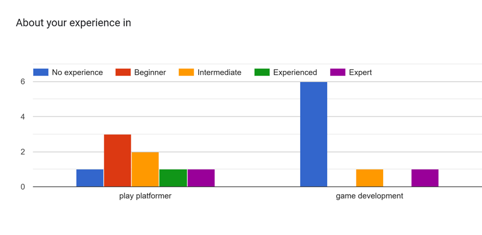
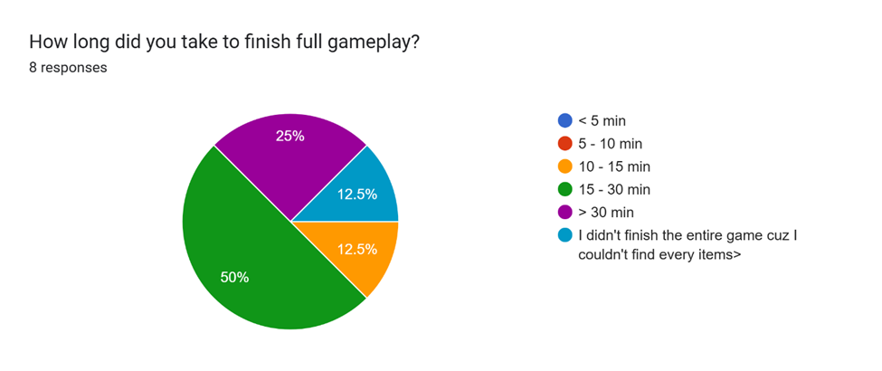
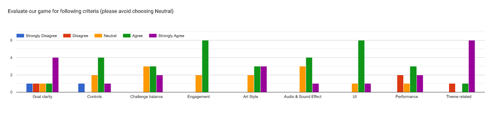
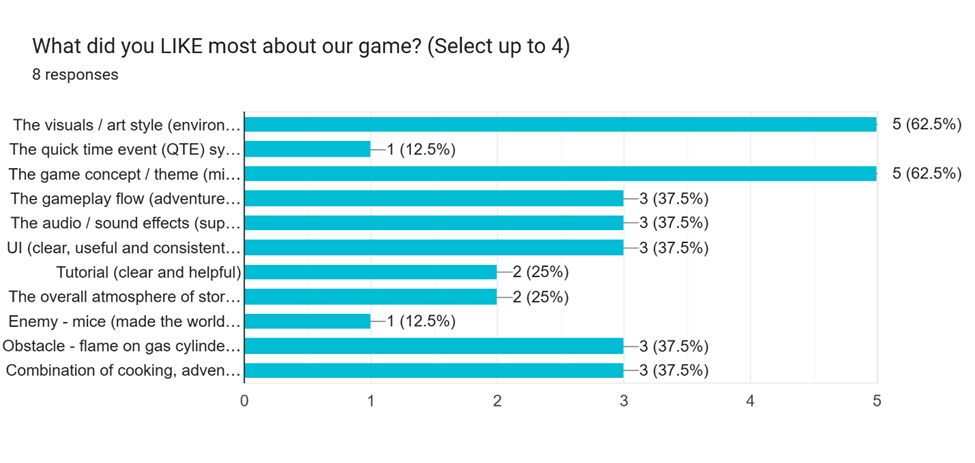
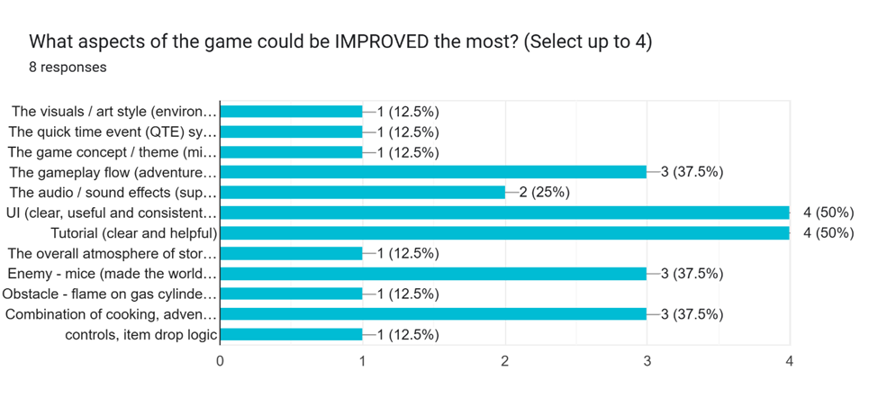

# Project 2 Report

Read the [project 2
specification](https://github.com/feit-comp30019/project-2-specification) for
details on what needs to be covered here. You may modify this template as you
see fit, but please keep the same general structure and headings.

Remember that you should maintain the Game Design Document (GDD) in the
`README.md` file (as discussed in the specification). We've provided a
placeholder for it [here](README.md).

## Table of Contents

- [Evaluation Plan](#evaluation-plan)
- [Evaluation Report](#evaluation-report)
- [Shaders and Special Effects](#shaders-and-special-effects)
- [Summary of Contributions](#summary-of-contributions)
- [References and External Resources](#references-and-external-resources)

## Evaluation Plan

### 1. Purpose

**Primary Goal**

This evaluation aims to systematically assess both _usability_ and _player_ experience through a mixed-methods approach, combining **observational** and **querying** techniques to triangulate data and ensure comprehensive coverage of potential issues.

**_Specific Objectives_**

#### 1. Identify Usability Barriers

#### 2. Measure Player Engagement and Flow

#### 3. Validate Design Decisions

#### 4. Collect Actionable Feedback for Refinement

\***\*Why This Matters\*\***:
Without systematic evaluation, we risk submitting a game that works for developers but confuses players. This evaluation directly demonstrates our ability to iterate based on real user feedback.
---

### 2. Evaluation Techniques

| Technique                      | Type          | Description                                                                                                                                                                                                                                                           | Why We Chose It                                                                                                                   | Example Tasks                                                                                    |
| ------------------------------ | ------------- | --------------------------------------------------------------------------------------------------------------------------------------------------------------------------------------------------------------------------------------------------------------------- | --------------------------------------------------------------------------------------------------------------------------------- | ------------------------------------------------------------------------------------------------ |
| **Cooperative Evaluation**     | Observational | Evaluator and participant work together as partners. Evaluator actively asks questions during gameplay, and participant can ask clarification. Creates a dialogue to uncover issues in real-time. We should also note hesitation, confusion, and unexpected behavior. | Reveals not just what goes wrong, but WHY—by asking "What are you trying to do?" we understand player intent vs. system feedback. | “Why do you choose to go this way on the ground instead of that way jumping onto the furniture?” |
| **Post-Session Questionnaire** | Querying      | Participants complete a short form immediately after gameplay to reflect on their experience.                                                                                                                                                                         | Allows quantifiable analysis of enjoyment, clarity, difficulty, and appeal factors across multiple users.                         | Example: “Rate your overall enjoyment of the game on a scale from 1–5.”                          |

| **Questionnaire - Detailed Questions** |                                                                                                                                                                                    |                                                                                     |                                       |
| -------------------------------------- | ---------------------------------------------------------------------------------------------------------------------------------------------------------------------------------- | ----------------------------------------------------------------------------------- | ------------------------------------- |
| **Category**                           | **Question**                                                                                                                                                                       | **Purpose**                                                                         | **Response Type**                     |
| Enjoyment                              | Rate your overall enjoyment of the game (1 – Not fun, 5 – Very fun).                                                                                                               | Measure overall satisfaction and engagement.                                        | Likert scale (1–5)                    |
| Usability & Clarity                    | How intuitive were the controls? (1 – Confusing, 5 – Very intuitive)                                                                                                               | Evaluate ease of use and control design.                                            | Likert scale (1–5)                    |
| Usability & Clarity                    | Did you always understand your current objective?                                                                                                                                  | Assess clarity of gameplay goals and instructions.                                  | Multiple choice (Yes / No / Somewhat) |
| Usability & Clarity                    | How responsive did the character feel when you pressed keys or interacted? (1–5)                                                                                                   | Identify issues with input responsiveness and feedback.                             | Likert scale (1–5)                    |
| Appeal Factors                         | Which aspects most attracted you to the game? (Select up to 2):  • Art style  • Strong interactivity and environment reactions  • “Run from danger” mechanics  • Story | Discover what draws players in and informs future design priorities.                | Multiple choice                       |
| Difficulty & Balance                   | How challenging did you find the game? (1 – Too easy, 5 – Too hard)                                                                                                                | Evaluate balance and pacing of difficulty.                                          | Likert scale (1–5)                    |
| Error & Bug Experience                 | Did you encounter any errors or unexpected behaviour during gameplay?                                                                                                              | Detect and categorise potential bugs or technical issues affecting user experience. | Multiple choice (Yes / No)            |
| Error & Bug Experience                 | If yes, please briefly describe what happened and when.                                                                                                                            | Gather detailed feedback for debugging and improvement.                             | Short answer                          |
| Open Feedback                          | What was your favorite part of the game?                                                                                                                                           | Capture qualitative feedback on highlights and strengths.                           | Short answer                          |
| Open Feedback                          | What part would you improve or change?                                                                                                                                             | Gather suggestions for future iteration.                                            | Short answer                          |
| Open Feedback                          | What was your favorite part of the game?                                                                                                                                           | Capture qualitative feedback on highlights and strengths.                           | Short answer                          |
| Open Feedback                          | What part would you improve or change?                                                                                                                                             | Gather suggestions for future iteration.                                            | Short answer                          |

---

### 3. Participants

| Aspect              | Details                                                                                                                                                                                                                                                                              |
| ------------------- | ------------------------------------------------------------------------------------------------------------------------------------------------------------------------------------------------------------------------------------------------------------------------------------ |
| **Target audience** | Casual gamers (**young adults** and teenagers), familar and/or have interests in **cooking**, **adventure** and **platformer** games (e.g. Overcooked!, Ori and the Blind Forest, Untitled Goose Game) in .                                                                          |
| **Recruitment**     | COMP30019 classmates and friends                                                                                                                                                                                                                                                     |
| **Count**           | 5 (Observational) + 5 (Querying) = 10 (total)                                                                                                                                                                                                                                        |
| **Criteria**        | Participants must:  • Be comfortable using keyboard controls  • Not be involved in the development of this project  • Have played at least one 2D or 3D platformer before  • (Querying only) Have access to a device capable of running the game on WebGL (PC or laptop) |

---

### 4. Data Collection

| Data Type        | Collection Method           | Tools/Equipment                          | Purpose                                                                                 |
| ---------------- | --------------------------- | ---------------------------------------- | --------------------------------------------------------------------------------------- |
| **Behavioral**   | Audio-recorded dialogue     | Smartphone recorder                      | Capture evaluator-participant conversation to reveal player intent and confusion points |
| **Behavioral**   | Evaluator observation notes | Pen/ online document                     | Document real-time interactions, hesitations, errors                                    |
| **Quantitative** | Unity automated logging     | Built-in Debug.Log system                | Track completion time, time of deaths to achieve HE, navigation patterns                |
| **Subjective**   | Post-session questionnaire  | Google Forms (Likert scales + open-text) | Measure perceived difficulty, enjoyment, intuitiveness and improvement ideas            |

---

### 5. Data Analysis

| Source                 | Analysis Method                                                                                                               | Metrics / Indicators                                                                                  |
| ---------------------- | ----------------------------------------------------------------------------------------------------------------------------- | ----------------------------------------------------------------------------------------------------- |
| **Observational Data** | Thematic analysis of notes and screen recordings to identify confusion points, hesitation patterns, and behavioural trends.   | Counts of errors, hesitation points, navigation mistakes                                              |
| **Questionnaire Data** | Statistical analysis of post-session responses (e.g., calculating means, standard deviations, and distribution patterns).     | Mean enjoyment score, intuitiveness rating, perceived difficulty, reported bug frequency              |
| **Gameplay Logs**      | Quantitative comparison across participants and correlation analysis between performance metrics and questionnaire responses. | Total time to complete the game, number of deaths, QTE success rate, error frequency, completion rate |

> Results from these analyses will guide targeted design improvements — for example, refining unclear tutorials, rebalancing difficulty, or improving QTE loops.

---

### 6. Timeline

| Due Date     | Task                                                                                                            |
| ------------ | --------------------------------------------------------------------------------------------------------------- |
| Oct 16 (Thu) | Prepare evaluation materials (session design for Observational and Questionnaire for Querying)                  |
| Oct 17 (Fri) | Finish scheduling for observational game-test sessions; send game link and questionnaire for querying game-test |
| Oct 23 (Thu) | **Data Collection** Finish conducting all observational sessions and get back feedback from all questionnaries  |
| Oct 28 (Tue) | **Data Analysis** Finish data analyse and summarise collected data (observations, logs, and responses)          |
| Oct 31 (Fri) | Finish report writing                                                                                           |

---

### 7. Responsibilities

| Team Member             | Responsibilities (Aligned with Timeline)                                                                                                                                                                                                                                                                                                                       |
| ----------------------- | -------------------------------------------------------------------------------------------------------------------------------------------------------------------------------------------------------------------------------------------------------------------------------------------------------------------------------------------------------------- |
| **Kexin Liang**         | **Preparation (Oct 16–17):** Lead design of evaluation materials (Think-Aloud protocol and questionnaire).   **Data Collection (Oct 17–23):** Host and observe live game-testing sessions, take observation notes and manage screen recordings.   **Reporting (Oct 28–31):** Summarise observational findings and provide insights for the final report. |
| **Difei Li**            | **Preparation (Oct 16–17):** Handle participant recruitment and scheduling for both evaluation methods.   **Data Collection (Oct 17–23):** Distribute and track questionnaire responses; ensure all forms are returned.   **Reporting (Oct 28–31):** Clean and compile all raw data for analysis.                                                        |
| **Xinyue (Cassie) Luo** | **Data Analysis (Oct 23–28):** Lead analysis of both qualitative (Think-Aloud) and quantitative (questionnaire) data; create charts and tables.   **Reporting (Oct 28–31):** Draft the Evaluation section in REPORT.md, integrate findings into the final submission, and ensure consistency across all results.                                            |

---

### 8. Success Criteria

| **Criterion**              | **Target**                                                               |
| -------------------------- | ------------------------------------------------------------------------ |
| **Completion Rate**        | ≥ 80% of players complete the game with the help of the tutorial.        |
| **Confusion Reduction**    | Observed confusion incidents reduced by ≥ 80% after redesign iterations. |
| **Performance Indicators** | ≥ 70% average QTE success（perfect/good) rate among players.             |
| **Engagement**             | ≥ 80% of participants report positive enjoyment (rating ≥ 4 / 5).        |

---

### 9. Ethical Considerations

All participants will be informed that:

- Data is collected solely for academic purposes
- Participation is voluntary and anonymous
- They can withdraw at any time without consequence

No personal data will be shared or stored beyond project submission.

# Evaluation Report

## Summary

More than 10 participants took part in our game testing:  
- Five were evaluated through observation, and
- Ten were invited to complete a questionnaire, from which eight valid responses were collected.  

Both evaluation methods revealed common issues related to game difficulty and players getting stuck during movement.

## Adjustments

### First Round

#### 1. Smooth Control
Initially, the character’s jump height depended on how long players held the space bar — the longer they pressed, the higher the jump. Most players did not realize this mechanic and tended to tap the space bar briefly, resulting in very short jumps. Consequently, they often failed to reach furniture or platforms.   
The jumping system was redesigned to include a double jump mechanic (press space twice for a second jump). Additionally, pressing the space bar now always triggers a consistent jump height, making the controls more intuitive.

---

#### 2. Reduce Game Difficulty

In the original version, players only had one life, so being attacked by a mouse or touching fire caused an immediate restart.  During testing, many players reached the final baking stage but lost progress due to small mistakes.   
To balance the difficulty, serval changes were made:

- **Increased player health**  
  Players now have three lives. Each attack costs one life, improving fault tolerance and allowing more recovery opportunities.

- **Lower fire chance**  
  The probability of fire appearing was reduced from 25% → 20%.  
  Even this small change significantly reduced difficulty, as multiple fires often appeared simultaneously.

- **No HP loss during oven QTE**  
  Players often stood near the oven (also along the mice’s patrol path) and got attacked during QTEs.  
  To avoid accidental damage due to unclear guidance, players are now invulnerable during oven QTEs.

---

#### 3. Immediate Access to the Ending
Originally, the ending scene was only unlocked after players decorated the cake, which required finding all decoration ingredients and completing a QTE.    
However, some high-scoring players couldn’t find all ingredients, preventing them from reaching the happy ending. To fix this, a submit button was added, becoming available after mandatory dialogues. This allows players to view the ending anytime, even without finding every ingredient.

---

#### 4. Adjust Models to Prevent Stuck Issues
Several testers reported the character frequently getting stuck in various spots. These issues were fixed by repositioning models and modifying collider components in the inspector. 
- For example, plants originally used mesh colliders, which caused the character to get stuck in the leaves.  Replacing them with capsule colliders significantly reduced this issue.

---

#### 5. Adjusted Character Starting Position
The original starting point was placed on the mice’s patrol path, causing immediate HP loss if players didn’t move quickly.The starting point was relocated to ensure players have time to react before encountering enemies.

---

#### 6. Mandatory Intro Tutorial
The tutorial was initially accessible only through the pause menu, meaning many players were unlikely to open it without explicit direction.   
Therefore, a mandatory intro tutorial now appears automatically after the opening dialogue. This ensures players read the mission guide and clearly understand their objectives before beginning play.

---

#### 7. Restricted QTE Activation Area
Originally, players could trigger QTEs even when the pot was moved to unintended locations, sometimes making gameplay easier.  
QTEs can now only be triggered when the pot is placed at its original position. This prevents players from carrying the pot to unintended locations that could make the game easier.

---

#### 8. Added Pot Direction Indicator
Although pot direction was mentioned in the tutorial, some players skipped or skimmed the instructions.  
To provide clearer guidance, a visual indicator was added on the screen to show the correct pot orientation during gameplay.

---

#### 9. Adjust Main Camera
Some players found forward and backward movements visually unclear.  
To improve depth perception and movement clarity, the main camera’s rotation was adjusted to provide a readable perspective of the scene.

---

### Second Round

#### 1.	Character No Longer Gets Stuck in the Oven  
During the baking stage, the character could easily become stuck inside oven when the door automatically closed. To fix this, we adjust the oven door’s automatically close distance, ensuring that it no longer shuts unexpectedly when the character is nearby.

---

#### 2. Only milk can be picked up from the refrigerator  
Originally, all items inside the refrigerator could be picked up as potential ingredients regardless whether they were correct or not. However, testing revealed that when players picked up and dropped incorrect items, those items often blocked the narrow refrigerator area, causing the character to get stuck.   

---

#### 3.	Disable other buttons when one menu is active  
There were three on-screen buttons: Pause Menu, Checklist, and Submit buttons. Initially, these buttons could all be activated simultaneously, allowing multiple menus to overlap and clutter the screen.
To resolve this, we adjusted the code of these menus that temporarily disables all other buttons when one menu is open.

## Findings

### Player demographic
The game testing participants were primarily friends or schoolmates of the developers, most of whom are young adults. Base on the Q&A during observation and the questionnaire results (Fig 1.), almost all participants had prior experience with platform games, regardless of whether they were beginners or advanced players. However, only a small portion had any experience in game development. Overall, the participant group aligned well with our target audience defined in the evaluation plan: casual gamers who enjoy platformer games but lack game development experience.  
  
Figure 1.  

---

### Game completion  
As shown in Figure2, half of the players completed the game within 15-30 minutes, while a quarter took more than 30 minutes, which was significantly longer than the 10 minutes we initially expected.  However, this time included the period spent learning objectives, understanding movement and interaction control, location hidden ingredients, and repeating attempts after game overs.  Considering these factors, a completion of 15-30 minutes can be regarded as a reasonable duration for new players.  
  
Figure2.  

---

### Findings from observation  
The observational tests were conducted at an early stage, when the game was still under development. Because the developers had already played the game numerous times, we had become overly familiar with the controls, mechanics and level design, and thus overlooked the potential challenges for new players.   
The first three observational tests revealed serval critical issues such – most notably, difficult character control and the challenge of having only one life. In addition to these findings, some interesting behavioral patterns were also recorded:  

#### 1. All players found the same first ingredient  
  Every player’s first discovered ingredient was flour. This occurred because the character’s starting point was close to the flour was visually prominent in the scene. Moreover, flour is an intuitive ingredient associated with baking, so players naturally picked it up first. This design worked as intended, helping players get familiar with the controls early in the game.

---

#### 2.	Jumped cross flames when they were extinguished  
  Due to the unclear flame visuals and non-intuitive damage calculation, players often failed at this obstacle.  Many attempted to jumped across when the flames were temporarily extinguished, which contradicted our original intention: players were supposed to avoid active flame while crossing the area. To fix this, we reduced the fire spawn rate and improved the fire visual clarity and damage feedback, making the mechanic easier to understand.

---

#### 3.	Difficulty controlling the character
  Observations showed that players spent an average of about five minutes just reaching the first ingredient, even thought it was quite close to the starting point. This indicated that players need some time to adapt the character’s controlling because it was not smooth, and players often got stuck on environmental models. These issues highlighted the need for smoother movement controls and models rearrangements.

---

### Findings from questionnarie  
The questionnaire phase took place after many of earlier issues had been resolved, so the overall feedback was significantly positive compared to the observational phase. Fewer bugs were reported, allowing us to focus on further gameplay optimization rather than fundamental fixes.  
The questionnaire, created using Google Forms, consisted of several multiple-choice questions aimed at evaluating game difficulty, control responsiveness, and enjoyment. The results helped us identify remaining areas for improvement in player experience and game balance.

---

#### Evaluation of the game based on key criteria
As show in Fig 3., most evaluation categories received positive feedback from players. However, areas such as goal clarity, control, performance and theme related showed some disagreement, indicating that serval aspects still require improvement.   
Interestingly, while players appreciated the concept and story of the game, some felt that the gameplay itself did not fully convey the intended “miniature” theme. To address this gap, a character shrinking animation was added after the opening dialogue, making the miniature concept more visually.  
  
Figure 3.

---

#### Top two most popular features  
Players showed the strongest appreciation for the game’s art style and storyline.  
 A great deal of effort went into maintaining a consistent, charming visual design and developing a cohesive narrative. We also created custom character portraits and CG illustrations for both the opening and ending scenes. The story follows a complete and satisfying arc: the character shrinks, explores a dangerous kitchen, and eventually returns to normal size after overcoming obstacles and baking a wonder cake. While the gameplay representation of the miniature theme was initially subtle, the story concept itself was similar to It Takes Two, which won the favors of players. Overall, players were most impressed by the art direction and game concept.

  

#### Top two features needing improvement
The two areas that required the most improvement were the user interface (UI) and the tutorial.   
In an effort to maintain a consistent and visually appealing art style, some UI elements were designed to blend seamlessly with the environment. Additionally, the fonts used in the UI were selected to match the cat-themed design, which enhanced the decorative aesthetic but inadvertently reduced readability. As a result, certain buttons and text became less noticeable, causing some players to overlook important interface elements during gameplay.  
Regarding the tutorial, although an introductory tutorial was added and played automatically after the opening dialogue, serval players mentioned that they did not carefully read through all the pages due to the large amount of text. Nevertheless, given the complexity of the controls and gameplay flow, it remains important to clearly explain the full mission and mechanics.   
Due to technical and time limitation, we were unable to implement a step-by-step interactive tutorial that guides players dynamically during gameplay. This feature would help players learn through action rather than reading, which provided a key direction for out future improvement.  

  

## Shaders and Special Effects

- descriptions: what? what does the shader do (effect)?
- rationales: why we use the shader in the game (enhance/ improve...)
- exact path (with link)
- images/gifs
- showwing how the shader effects fit into the rendering pipeline/Unity engine (link to theory)

## Summary of Contributions

code contribution on each .cs/.shader

## References and External Resources

TODO - see specification for details
